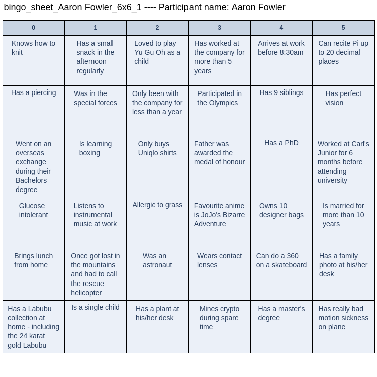
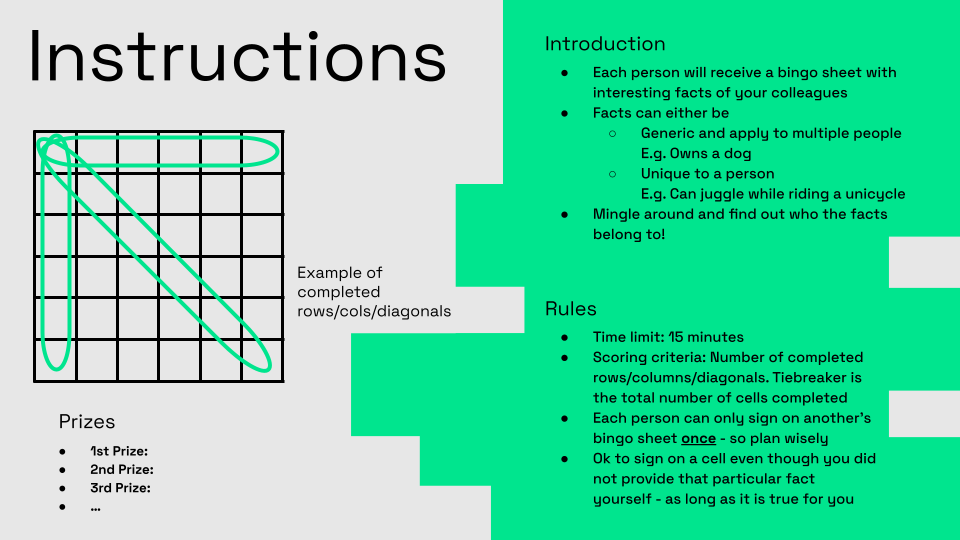

# Co-Worker Bingo Sheet Generator

**Co-Worker Bingo** is a great ice breaker game to know your colleagues - one grid at a time! Each participant is given a bingo sheet with interesting facts of their colleagues and they have to go around and find out who the facts belong to. The person who collects the highest number of completed rows/columns/diagonals within the allotted time wins!

Co-Worker Bingo can be played not only in a workplace setting but also among classmates, friends, and family to encourage team bonding and help everyone become familiar with one another.

Creating these bingo sheets manually is a painstaking process especially for large groups. This repository contains the necessary Python code to quickly generate bingo sheets for groups with >10 people so the preparation process is as hassle-free as possible.


### Example Generated Bingo Sheet



### System Requirements
- Python >=3.10
- Internet connection (to install required dependencies via pip)

### Installation

1. Clone the repo
2. Start a terminal/command prompt at the git root directory
3. Run the following commands to create a virtual env, install necessary packages and install the `coworker_bingo` package

```
python -m venv venv
source venv/bin/activate
pip install -r requirements.txt
pip install -e  .
```

### Preparing the Required Data

Replace/edit the following files in the `input_files` directory

##### 1. **generic_facts.txt**
- Each line consists of a fact that should apply to multiple participants

##### 2. **specific_facts.csv**
- First column "Name" should contain the names of all participants
- Subsequent columns (Fact1, Fact2, ...) should contain unique facts that apply to the a specific participant
- For each row, the first entry is the participant's name and then the rest of the entries are special facts about that participant
- It is fine if a participant does not provide any facts or less than the maximum allowed number of facts
- You can create a questionnaire (e.g. using Google Forms) to collate the required information
- **IMPORTANT**: Remove all **commas** from each fact as it will affect the reading of the information from the csv file


### Generating the Bingo Sheets

**Note**: Sample data is provided in `input_files` folder so you can test out the generation script without any data collection

1. Activate your Python virtual env (if you have not done so)
```
source venv/bin/activate
```
2. Open `scripts/config.py` and adjust any necessary settings
3. Run the following command to generate the bingo sheets
```
python scripts/generate_sheets.py
```
4. By default, all bingo sheets will be saved in the `generated_sheets` folder
5. Print out the sheets and enjoy the game! You can use a tool like [pdftk](https://www.pdflabs.com/tools/pdftk-the-pdf-toolkit/) to combine all pdfs into a single file to be printed together

### Game Rules Slide Deck

A sample slide deck (pptx/odt) with game rules can be found in the `presentation_slides` folder so you do not have to spend any effort preparing it and just get started playing!


